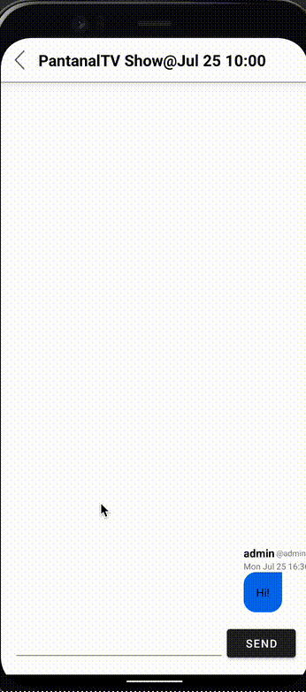

# WeWatch

## Table of Contents
1. [Overview](#Overview)
2. [Product Spec](#Product-Spec)

## Overview
### Description
This app is centered around finding other students at your college to watch movies/Tv shows with virtually. The app will support ways for students to interact once an event is agreed apon and will later be expanded to other activities.

### App Evaluation
- **Category:** Social
- **Mobile:** Mobile firs  experience, will utilize camera and the microphone.
- **Market:** Any student attending a college can utilize this app.
- **Habit:** Students are using this throughout the day to post movies/shows they want to watch and accept other events. This can be done through a "feed" tab where users can view movie/tv show posts from other students at their university

## Product Spec

### 1. User Stories (Required and Optional)

**Required Must-have Stories**

- [x] Users can log in and log out
- [x] Users can create an account
- [x] Users can create events with a specific time and date using an in-app calendar 
- [x] Users can interact with events by indicating that they are interested
- [x] Owners of events can delete their event if they are the only one attending
- [x] Users can update an event with new time suggestions
- [x] Users can view a filtered feed of events
    - [x] Users can filter this feed by date, popularity and rating of content
- [x] Users in the same event can join group chats with other users
    - [x] These group chats will open to users 24hrs before the event
- [x] Users will manually start movies when the agreed time come around
- [x] Users will be able to see which platforms offer the video content
- [x] Users can see your "post/event history", movies they have watched, and movies they wish to watch
- [x] Users will be able to view other users profiles
    - [x] Movies/Shows they wish to see
    - [x] Movies/shows they have already watched through the app

**Optional Nice-to-have Stories**

- [x] Users can search for other users
- [x] Users will be able to direct message other users
- [x] Users can create a list of movies they wish to see 
    - [ ] When another user creates an event with this specific movie, this user recieves a notification.
- [ ] Users can add new Movies/Tv shows that are not already included in the database
- [ ] Users can request for a random movie/event to be selected when they are bored
- [ ] Users can create post about other topics
- [ ] Users receive onscreen directions/imbedded software to aid in starting video content at the same time to simulate as if there is a single video player
- [ ] Users can start video calls with friends

### 2. Technical Problems
1. Implemented pagination using infinte scrolling 
2. Group chat that uses firebase to fetch and send messages in realtime to parcipants. Supports typing indicators to let a user know if another user is typing.
    * 
<!--     *  -->
4. Algorithm that governs the logic of the feed page. A single movie/TV show post can contain multiple times within them, binary search is used to efficiently insert the dates. Events are automatically deleted upon the date expiring. The feed page supports simultaneous UI updates when an event in view has an updated date, or when an event is created/deleted.
    * 

#### APIs/SDKs 
* <a href="https://www.themoviedb.org/?language=en-US">The Movie DB</a>
* <a href="https://lottiefiles.com">LottieFiles</a>
* <a href="https://material.io/design">Material Design</a>
----

#### More Demos

